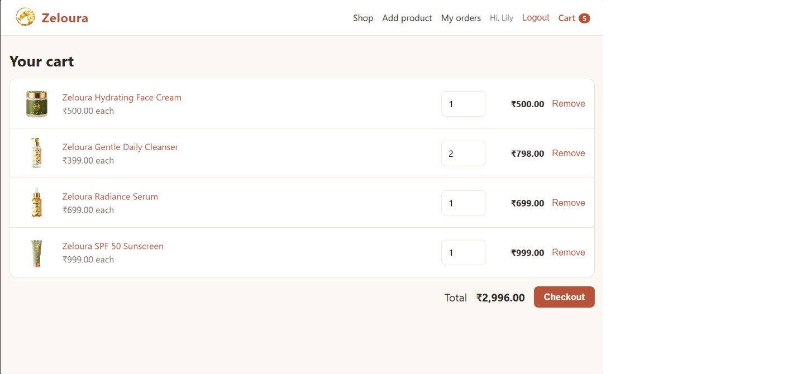
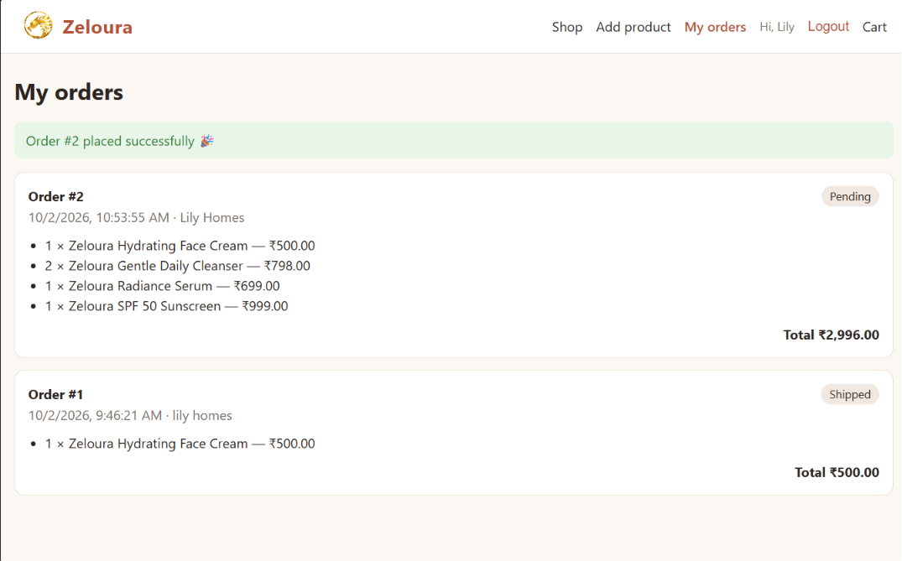

# Zeloura — Full-Stack Skincare Shop

A full-stack e-commerce app built during my internship: a **Django REST API** with a **React** storefront. Users can browse products, sign up, fill a cart, check out, and track their orders.

**Live demo:** _coming soon_

## Screenshots




## Features
- Product listing with search, product detail pages, and image upload
- Sign up / login with token authentication
- Shopping cart (saved in the browser) and checkout
- Orders with status (pending / shipped / delivered), managed from the Django admin
- Stock is reduced automatically on each order; an order that asks for more than the available stock is rejected
- The server looks up prices itself, so a customer cannot change the price from the browser
- Only shop admins (staff) can add products; only a product's author (or an admin) can edit or delete it
- Checkout validates name, Indian mobile number and delivery address, and fills in details from the customer's last order
- 14 automated API tests

## Tech stack
- **Backend:** Python, Django, Django REST Framework, SQLite
- **Frontend:** React, Vite, React Router, Axios
- **Auth:** token authentication

## Project structure
```
zeloura-shop/
├── backend/    Django + Django REST Framework  -> http://localhost:8000
└── frontend/   React + Vite                    -> http://localhost:5173
```
## Run it locally (VS Code)

1. Open the project folder in VS Code (**File → Open Folder**).
2. Open a terminal with **Terminal → New Terminal** and start the **backend**:
```powershell
cd backend
python -m venv .venv
.venv\Scripts\Activate.ps1
pip install -r requirements.txt
python manage.py migrate
python manage.py createsuperuser
python manage.py runserver
```
3. Click the **+** in the terminal panel to open a second terminal and start the **frontend**:
```powershell
cd frontend
npm install
npm run dev
```
4. Open http://localhost:5173 in your browser.

Next time you only need `.venv\Scripts\Activate.ps1` and `python manage.py runserver` in the backend terminal, and `npm run dev` in the frontend terminal.

The shop starts empty. Log in at http://localhost:8000/admin/ with the superuser you just created to add products, or log in on the shop site (http://localhost:5173) with that same account and use **Add product**. Normal customers can browse and order but cannot add products.

## How the two halves talk
React (`frontend/src/api.js`) → HTTP + JSON → Django (`backend/api/`)

| What | Endpoint |
|---|---|
| Sign up / login / logout / who am I | `POST /api/auth/register/` `login/` `logout/`, `GET /api/auth/me/` |
| List / search products | `GET /api/products/?search=serum` |
| Product detail | `GET /api/products/<slug>/` |
| Add product (staff only) | `POST /api/products/` (multipart, with image) |
| Delete product (author only) | `DELETE /api/products/<slug>/` |
| Place order (login) | `POST /api/orders/` |
| My orders (login) | `GET /api/orders/` |

Login gives the browser a token, and `api.js` attaches it to every request automatically.

## Tests
```powershell
cd backend
python manage.py test
```

## Roadmap
- Deployment
- Payment gateway (Razorpay / Stripe)
- Edit-product page in React (the API already supports it)
- Categories, reviews, pagination